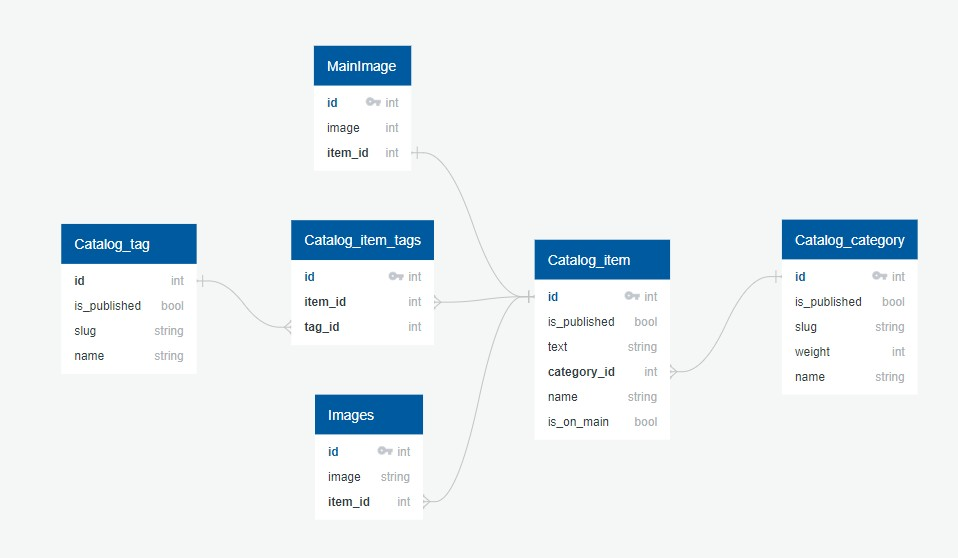

## Проект запускается на версиях питона 3.10, 3.11, 3.12
[](https://gitlab.crja72.ru/django/2024/spring/course/students/199562-sav1ngeorgiy-course-1112/-/commits/main)

### Для Windows:
* Создать виртуальную среду
```bash
python -m venv venv
```
* Активировать её
```bash
venv/Script/activate
или
venv/Script/activate.bat
```
* Устанавливаем все необходимые зависимости(прод будет загружен при установке любого из первых двух)
```bash
pip install -r requirements/test.txt - для тестов
pip install -r requirements/dev.txt - для разработки
pip install -r requirements/prod.txt - для продакшена
```
* Переходим в проект lyceum
```bash
cd lyceum
```
* Создаём миграции(catalog)
```bash
python manage.py makemigrations catalog
```
* Применяем миграции
```bash
python manage.py migrate
```
* Запускаем тесты для проверки работоспособности
```bash
python manage.py test
```
* Запускаем проект после прохождения всех тестов
```bash
python manage.py runserever
```

## Для Linux(запускаемся из папки проекта):
* Установка виртуально среды
```bash
$ pip3 install venv
```
* Активация виртуальной среды
```bash
$ source venv/bin/activate
```
* Установка всех продовых зависимостей
```bash
pip install -r requirements/test.txt - для тестов
pip install -r requirements/dev.txt - для разработки
pip install -r requirements/prod.txt - для продакшена
```
* Меняем директорию на lyceum
```bash
cd lyceum
```
* Создаём миграции(catalog)
```bash
python manage.py makemigrations catalog
```
* Применяем миграции
```bash
python manage.py migrate
```
* Запускаем тесты для проверки работоспособности
```bash
* python3 manage.py test
```
* Запускаем проект после прохождения всех тестов
```bash
$ python3 manage.py runserver
```

Вот так должна выглядеть система таблиц в базе данных
ER у меня и здесь и просто картиночка (или erDiagram))
